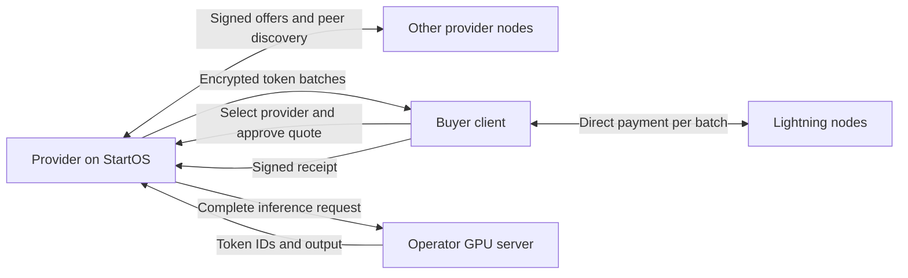

# Offence protocol specification

Project name: Offence. Protocol: `offence-lab-v1`.
This document defines the intended service and its lab boundaries. Verified work and
remaining implementation status belong in AGENTS.md and ROADMAP.md.

## Product contract

Anyone may run a provider without registration, approval, deposits, or a central
operator. Software is FOSS under MIT. No new asset, blockchain, mandatory exchange,
mint, directory operator, or dispute operator is introduced.

A provider runs a complete inference workload on hardware it controls. The StartOS
service connects to the operator's GPU inference server. It does not partition a
request across independent sellers. Buyers explicitly choose a provider and model;
future buyer software can automate selection using local policy.

Providers choose prices. Buyers pay for generated output tokens they receive,
including tokens received before a later failure. Answer quality is a market signal,
not a payment arbiter. Backend unavailability, malformed streams, and failure to
complete accepted work affect track records. Being intentionally offline is not
itself a breach of an accepted request.

Sellers sign claims identifying the exact model offered. Buyers assess those claims
through reputation, their own checks and provider selection. Cryptographic execution
proof is optional and is not a prerequisite for payment. Signatures bind claims to
identities; model hashes identify files. Neither establishes what actually ran.
Buyers may explicitly require execution proof, with no silent policy downgrade.

## Architecture

Peer discovery and inference sessions are separate. Gossip contains public offers,
not prompts, response plaintext, wallet credentials, or payment preimages. The peer
network does not validate Bitcoin transactions or custody BTC. LND manages Lightning.

## Identity and wire encoding

- Persistent Ed25519 keypair per provider; buyers may use separate keys.
- Public key hex is the network identity. No email, certificate authority enrollment,
  or real-world identity is required for membership.
- Envelope: `{signer, body, signature}`. Signatures cover the signer and body with
  domain `offence/v1\0`.
- Canonical encoding is sorted-key compact JSON, ASCII escaping, integers within
  the exact JSON safe-integer range, and no floating point. It is a project-specific
  encoding, not a claim to implement RFC 8785.
- SHA-256 commits to model identities, quotes, batches, and receipt references.
- TLS or onion transport protects sessions in transit. Application signatures bind
  peer identity independently of transport. Public HTTP is not auto-dialled.
- Key replacement creates a new identity and does not inherit the old reputation.
  Backups must preserve the node identity; running cloned keys concurrently is unsafe.

## Model identity

A versioned manifest contains name, architecture, quantization, context limit, and
artifact records. Each artifact has a relative path, SHA-256, byte length and role.
An embedded GGUF may contain weights, tokenizer and metadata in one artifact.
Separate files must list all inputs relevant to execution, including adapters and
chat templates. The manifest ID sorts artifacts by path and excludes mirror URLs.

A provider may point to Hugging Face or another source for convenience. Publishers
are not admission authorities. A verifier hashes local files and rejects missing,
changed, or escaping paths. File verification must be reported separately from
execution verification. A backend model alias is never the model identity.

The lab completion endpoint accepts a raw prompt with deterministic temperature-zero
settings. Chat templates and automatic model switching are outside that profile.
An optional cryptographic execution statement must pin numerical runtime semantics and sampling,
not just weights.

## Discovery

Each node can learn peers from operator-configured seeds and a persisted local
cache. Peers exchange signed advertisements, each with identity, endpoint, monotonically
increasing sequence, issue time, expiry, optional model offer, and availability.
Advertisements expire within five minutes. New records cannot roll back a live
sequence number. The cache is bounded; expired records are removed.

The lab uses HTTP request/response gossip with connection timeouts, four candidate
exchanges per tick, bounded message sizes, jittered selection, and failure backoff.
It does not implement the Bitcoin wire protocol, a DHT, or globally complete search.
A buyer searches locally known offers. No bootstrap service is required once usable
peers are known; discovery from a completely empty cache requires an introduction.

Automatically dialled addresses are literal globally routable HTTPS IPs or v3 onion
origins. Private addresses and ordinary DNS names require an exact operator-approved
origin. Redirects are not followed. This prevents unauthenticated gossip from turning
a node into a scanner of the operator's LAN or cloud metadata endpoints. The GPU
backend address is operator configuration, never a value supplied by a peer.

Reachability options: explicit LAN addresses between reachable networks, publicly
reachable HTTPS, or a StartOS onion interface with an outbound Tor SOCKS proxy.
Discovery does not traverse NAT by itself. The lab does not implement hole punching,
relay circuits, automatic Tor proxy provisioning, or automatic public port mapping.

Before public production, add independent peer diversity, proven-address admission,
per-source quotas, stronger eviction, and adversarial topology tests. Free identity
creation and simple random selection do not solve Sybil or eclipse attacks.

## Offers and buyer choice

An offer contains the model manifest, output price in integer msat per token,
maximum output, batch size, context capacity, session deadline, payment timeout,
availability, and execution proof type. Hardware description is optional and
self-reported. Output pricing includes the provider's cost of processing the prompt;
there is no separate input-token charge in the initial profile.

Search filters include exact model ID, maximum output-token price, and minimum
context capacity. Latency estimates and track records must distinguish advertised
claims from locally measured observations. No central party ranks providers.
New identities start without history; they may compete on price without permission.

## Quote and stream state machine

1. Buyer signs a fresh request binding provider, model ID, random nonce, timestamp,
   prompt, maximum output tokens, spending cap, and proof policy.
2. Provider validates its model offer and capacity, rejects unavailable buyer-required proof,
   and returns a signed quote valid for 60 seconds. Pricing is frozen in the quote.
3. Buyer verifies provider identity and every budget/model field, then signs an
   acceptance binding the quote hash. The request cannot be accepted twice.
4. Provider generates a bounded batch of exact token IDs and associated text.
   Network/SSE chunks and characters must never be treated as token counts.
5. Provider encrypts the batch with a key derived from a fresh payment preimage,
   binds its header as authenticated data, and obtains a matching invoice if paid.
6. Provider durably stores the signed encrypted batch before transmitting it.
7. Buyer checks session, model, request, sequence, previous batch hash, price and
   cumulative limits, then durably stores ciphertext before payment.
8. Buyer applies its selected assurance policy. Reputation-based purchases accept
   signed seller claims without execution proof. Proof-required purchases must
   verify the complete execution/delivery statement before payment. Never label
   a reputation-based purchase as cryptographically verified.
9. Buyer pays the exact invoice, retains its payment result and preimage, decrypts,
   validates token count, displays output, and signs a receipt.
10. Provider waits for invoice settlement before releasing the next paid batch.
    Final completion is a signed end record. Error records do not invalidate earlier
    delivery. Timeout or disconnect stops further work and limits exposure.

Only one batch is outstanding per session. Default batch size is eight tokens,
configurable within 1 to 128. Payment latency and any optional proof latency therefore delay displayed
output relative to raw backend streaming. Provider GPU computation on an abandoned
batch remains an economic risk; the protocol does not guarantee zero unpaid work.

## Settlement and failure semantics

All arithmetic uses integer millisatoshis. Quote spending caps exclude routing fees;
the lab buyer separately caps the routing fee per payment. A production buyer must
expose a total fee budget as well as a batch fee limit.

In direct LND `preimage-v1` mode, an invoice's description hash commits to the encrypted batch. Its payment hash
commits to the decryption secret. The encryption key is SHA-256 of the protocol key
domain and the 32-byte preimage; encryption is ChaCha20-Poly1305 with a fresh nonce.
The protocol does not disclose paid preimages through gossip or public recovery.

Strike uses explicit opt-in `provider-key-v1`: the invoice still commits to the
ciphertext, but its payment hash differs from the private batch-key hash. The
supplier durably stores the key with the invoice reference before exposing the
invoice. Only the bound buyer can request it using a signed request and payment
preimage, after the supplier verifies credited settlement. The buyer needs the
supplier online after payment; payment alone cannot decrypt this mode. See
`docs/PAYMENT-READINESS.md` for recovery and retention semantics.

| Failure | Required behavior |
| --- | --- |
| Backend fails before a batch exists | No charge for that batch |
| Backend fails after earlier batches | Earlier received tokens stay payable |
| Buyer abandons an unpaid batch | No plaintext release; invoice expires; no further batch |
| Buyer pays then provider disappears | Direct LND: persisted ciphertext and wallet preimage decrypt offline. Strike: retain payment proof and wait for supplier key recovery |
| Network disappears before receipt | Preserve local payment and delivery records; do not assume nonpayment from missing receipt |
| Suspected wrong model | Retain evidence and update buyer-local reputation; a suspicion is not cryptographic proof of misconduct |
| Invalid output proof | Proof-required buyer refuses before paying |
| Missing proof | Reject proof-required requests; reputation-based purchases may proceed |
| Payment result is ambiguous | Reconcile the original payment hash with the wallet; never issue a replacement charge automatically |
| Refusal or low-quality answer | Delivered tokens are billed under the quote; quality and model-claim credibility affect buyer selection |

A returned Lightning payment is a separate payment. Do not describe invoice expiry
as refunding settled funds. No automatic refund guarantee is made for arbitrary bad
content. Strong correctness assurance depends on proof, not a voluntary refund API.

## Evidence and reputation

Provider signs offers, quotes and batches. Buyer signs requests, acceptances and
receipts. A receipt binds the batch hash, payment hash, session, sequence, and exact
received-token count. Sharing these records can demonstrate what keys acknowledged.
It cannot prove two identities are different people or make self-dealing expensive.

Maintain local observations and portable bilateral records. Claims about availability,
latency and incomplete sessions need observer scope and sample counts. An absent
receipt is not public proof of misconduct; a provider can withhold evidence and a
buyer can stop responding. No universal rating number is consensus-critical.

Prompts stay in memory during execution and never enter discovery. Encrypted delivery,
quotes, wallet outcomes and receipts are retained locally. The provider's recovery
window is seven days; buyers retain downloaded ciphertext and their keys. The GPU
provider can read prompts. Pseudonymity does not imply unlinkable traffic or payments.

## StartOS and Docker

The package is a CPU control service with one persistent volume and an HTTP interface
for the dashboard and signed peer API. It targets x86_64 and aarch64. The GPU backend
runs on an operator-specified host; the package does not silently change installed
GPU services or models. Configure Node provides peer addresses, GPU endpoint, an exact
model offer, and explicit free-lab opt-in. Regtest wallet configuration is a separate
Docker/operator workflow; the StartOS form does not accept nonzero pricing.

Credentials are passed through environment variable names and private files.
Backups include identity and recovery data. Public peers cannot change configuration,
read GPU credentials, read wallet credentials, or instruct arbitrary outbound URLs.

## Optional execution-proof acceptance gate

A candidate must be FOSS and tested against a pinned model and its exact computation
semantics. Verification must be local and independent of a vendor API. Test wrong
weights, tokenizer, context, sampling, prompt, token IDs, sequence, ciphertext, and
payment hash. Replayed proofs must fail when any bound statement changes.

Record prover hardware, RAM/VRAM, setup requirements, proof size, verification cost,
and median/tail proving latency under concurrent load. Include setup/key provenance
and model conversion semantics. An ordinary external process returning `true` is not
an acceptable verifier implementation.

This gate applies only to a cryptographically verified assurance mode. Reputation-based
payments do not depend on it. Production payment release still requires real Lightning
recovery tests, durable spend and fee limits, supplier abuse tests, and settlement
protocol review. Reputation does not guarantee correctness or refunds.
